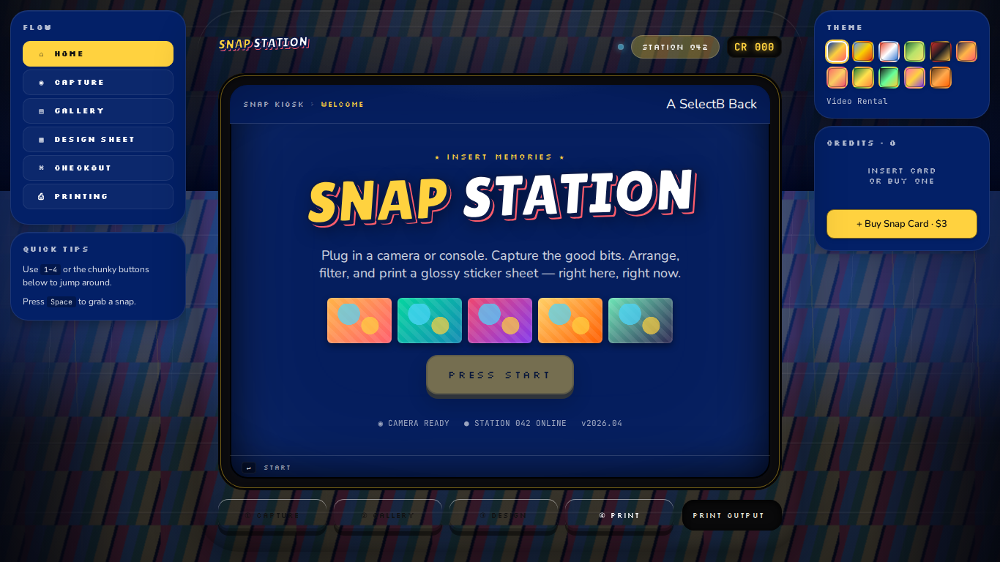
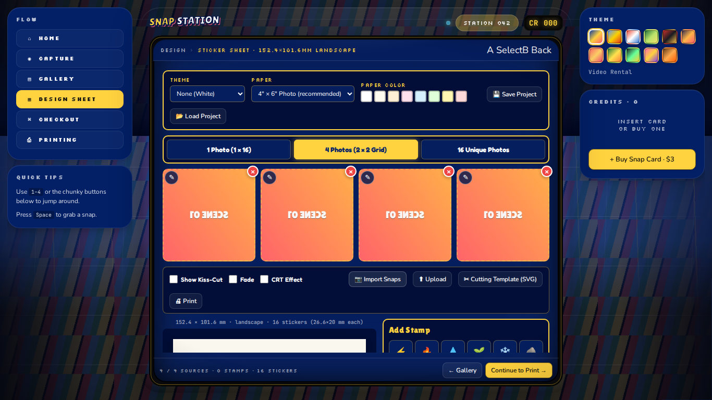
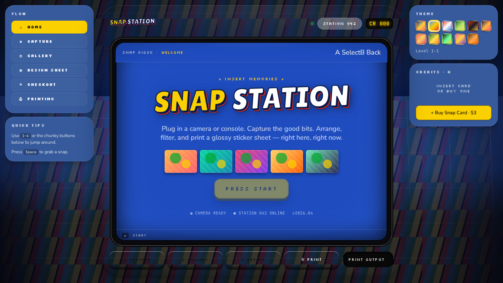

# Pokémon Snap Station

A modern recreation of the 1999 Blockbuster **Pokémon Snap Station** — play Pokémon Snap,
snap pictures of the game (or of yourself and your friends), compose a 4×4 sticker sheet,
and print it with real kiss-cut geometry measured from an original sticker sheet.

**Live:** https://andrewjfiore.github.io/snap-station/

## What's in the box

| Entry point | What it is |
| --- | --- |
| `index.html` | **The kiosk** — full attract → capture → gallery → design → checkout → print flow, cabinet chrome with CRT bezel, Blockbuster rental-shelves backdrop, simulated $3 Snap Card payment, attendant mode, gamepad/keyboard/touch |
| `classic.html` | The classic two-page suite in a tab shell |
| `snap-station.html` | Classic capture page — webcam or any window (emulator!) via screen share, zoom/pan/mirror, GIF recording, gallery, send-to-stickers |
| `sticker-sheet.html` | Classic composer — per-cell cropping, emoji/text stamps, JPG/PNG/PDF/GIF/Print export, **one-file Cricut/Silhouette Print-Then-Cut SVG** |



| Designer | Mario Level theme |
| --- | --- |
|  |  |

## Run it

No build step. No npm. Static files only.

```bash
python3 -m http.server 8000     # any static server works
# → http://localhost:8000/
```

The classic pages even run from `file://`. Everything is self-hosted — the suite works with
no internet connection at all.

## The sticker sheet is the real thing

Geometry is taken from an original Snap Station print: 4×4 stickers on a landscape sheet,
109.4 × 83 mm image area, 26.6 × 20 mm cells, kiss-cut 24.1 × 17.5 mm with 2.75 mm corners.
One exported SVG carries both the print raster and the cut paths, so Cricut Design Space
imports a ready-aligned Print-Then-Cut design. See `docs/STICKER_PRINTING_GUIDE.md`.

*"It'll cost you a measly three bucks for 16 stickers."* — the kiosk's Snap Card flow
recreates the original's collectible Pokémon Credit Card, in simulation (v1 decision; a
pluggable provider registry in `js/payment.js` is ready for real hardware).

## For developers

```bash
npm install                      # dev-only: Playwright
npx playwright install chromium
npm test                         # phone + tablet + laptop profiles, fake camera
```

- `js/` — shared framework-agnostic modules (geometry/constants, export pipeline, storage,
  payment, capture sources, sounds). The kiosk and the classic pages consume the same code.
- `kiosk/` — the kiosk app (React 18 UMD + babel-standalone at runtime; intentionally
  no build step).
- `tests/` — Playwright specs incl. Node-side geometry/export tests that pin the physical
  dimensions.
- `docs/` — requirements, printing guide, deployment (incl. kiosk hardware), inventory.
- `deploy/` — Raspberry Pi / Mac mini kiosk scripts and the CUPS print bridge.

## Documentation

- [`docs/REQUIREMENTS.md`](docs/REQUIREMENTS.md) — product spec + acceptance matrix
- [`docs/STICKER_PRINTING_GUIDE.md`](docs/STICKER_PRINTING_GUIDE.md) — print + Cricut/Silhouette
- [`docs/DEPLOYMENT.md`](docs/DEPLOYMENT.md) — Pages, kiosk hardware, versions
- [`docs/SCALE_MODEL_HARDWARE.md`](docs/SCALE_MODEL_HARDWARE.md) — physical build
- [`docs/INVENTORY.md`](docs/INVENTORY.md) — what every file is and where it came from
